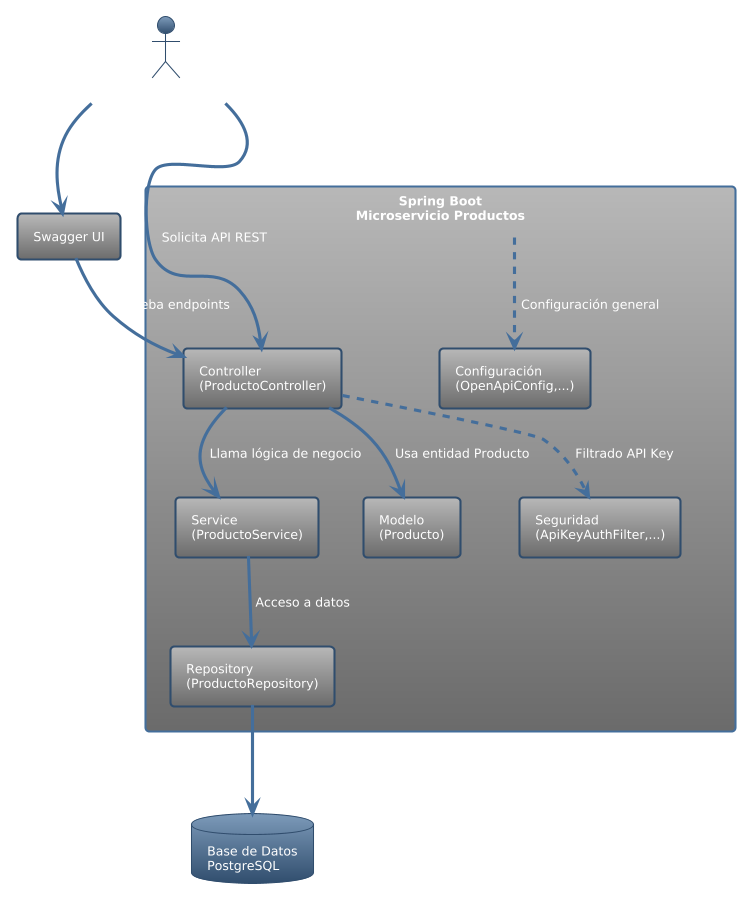
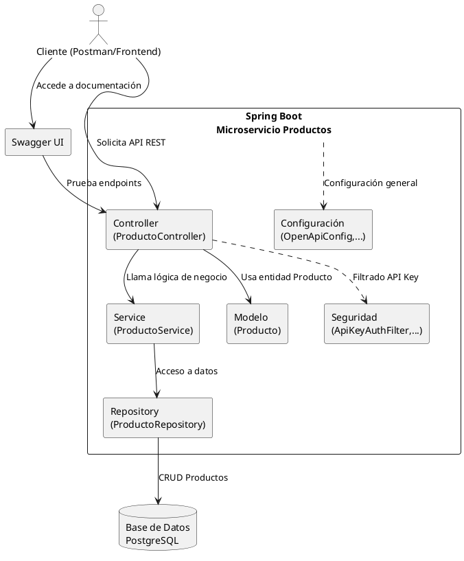

# Microservicio de Productos

Este proyecto es un microservicio desarrollado en Spring Boot para la gestión de productos, permitiendo operaciones CRUD sobre una base de datos PostgreSQL. Incluye autenticación por API Key, documentación interactiva con Swagger/OpenAPI, pruebas automatizadas y está preparado para despliegue en Docker.

---

## Tabla de Contenidos
- [Descripción General](#descripción-general)
- [Tecnologías Utilizadas](#tecnologías-utilizadas)
- [Requisitos Previos](#requisitos-previos)
- [Instalación](#instalación)
- [Configuración](#configuración)
- [Ejecución](#ejecución)
- [Estructura del Proyecto](#estructura-del-proyecto)
- [Arquitectura y Capas](#arquitectura-y-capas)
- [Diagrama de Interacción entre Servicios](#diagrama-de-interacción-entre-servicios)
- [Seguridad y Manejo de Errores](#seguridad-y-manejo-de-errores)
- [Documentación de Endpoints](#documentación-de-endpoints)
- [Uso de Herramientas de IA en el Desarrollo](#uso-de-herramientas-de-ia-en-el-desarrollo)
- [Pruebas](#pruebas)
- [Docker](#docker)
- [Autor](#autor)

---

## Descripción General

Microservicio RESTful para la gestión de productos, con operaciones para crear, consultar, actualizar y eliminar productos. Implementa seguridad basada en API Key y expone su documentación mediante Swagger UI.

---

## Tecnologías Utilizadas
- Java 17
- Spring Boot
- Spring Data JPA
- PostgreSQL
- Spring Security (API Key)
- Swagger/OpenAPI (springdoc-openapi)
- JUnit y Mockito
- Docker

---

## Requisitos Previos
- Java 17 o superior
- Maven 3.9.x
- PostgreSQL
- Docker (opcional, para despliegue)

---

## Instalación
1. Clona el repositorio:
   ```sh
   git clone <URL-del-repositorio>
   cd producto-service
   ```
2. Compila el proyecto:
   ```sh
   ./mvnw clean package
   ```

---

## Configuración
Edita el archivo `src/main/resources/application.properties` para configurar la conexión a la base de datos y la API Key:

```properties
spring.datasource.url=jdbc:postgresql://localhost:5432/productosdb
spring.datasource.username=postgres
spring.datasource.password=tu_password
service.api.key=tu_api_key
```

---

## Ejecución
Ejecuta la aplicación localmente:
```sh
java -jar target/Productos-0.0.1-SNAPSHOT.jar
```
Por defecto, la aplicación se ejecuta en [http://localhost:8080](http://localhost:8080).

---

## Estructura del Proyecto
```
producto-service/
├── src/
│   ├── main/
│   │   ├── java/com/example/Productos/
│   │   │   ├── controller/        # Controladores REST
│   │   │   ├── service/           # Lógica de negocio
│   │   │   ├── repository/        # Acceso a datos (JPA)
│   │   │   ├── model/             # Entidades
│   │   │   ├── filter/            # Filtros de seguridad
│   │   │   ├── config/            # Configuración (Swagger, Seguridad)
│   │   │   └── security/          # Clases de autenticación
│   │   └── resources/
│   │       └── application.properties
│   └── test/
│       └── java/com/example/Productos/
│           ├── service/           # Pruebas de servicios
│           └── integration/       # Pruebas de integración
├── Dockerfile
├── docker-compose.yml
├── pom.xml
└── README.md
```

---

## Arquitectura y Capas

El microservicio sigue una arquitectura en capas, separando responsabilidades para facilitar el mantenimiento y la escalabilidad:

- **Controller:** Expone los endpoints REST y gestiona las solicitudes HTTP.
- **Service:** Implementa la lógica de negocio y validaciones.
- **Repository:** Acceso a datos y operaciones CRUD usando Spring Data JPA.
- **Model:** Entidades JPA que representan los datos del dominio.
- **Seguridad:** Filtros y configuración de autenticación por API Key.
- **Configuración:** Integración de Swagger/OpenAPI y parámetros de seguridad.

---

## Diagrama de Interacción entre Servicios (PlantUML)

<p align="center">
  
</p>


---

## Seguridad y Manejo de Errores

### Seguridad (API Key)
- Todos los endpoints `/api/productos/**` requieren el header `X-API-KEY` con el valor configurado en `application.properties`.
- El filtro `ApiKeyAuthFilter` valida la presencia y validez de la API Key en cada solicitud.
- Las rutas públicas como Swagger UI y documentación están excluidas del filtro.

### Manejo de Errores
- Respuestas 401 (Unauthorized) si la API Key es inválida o ausente.
- Respuestas 404 (Not Found) si el recurso solicitado no existe.
- Respuestas 400 (Bad Request) para datos inválidos en la solicitud.
- Respuestas 500 (Internal Server Error) para errores inesperados.
- Los mensajes de error son claros y orientados al usuario/desarrollador.

---

## Documentación de Endpoints

| Método | Endpoint                | Descripción                        |
|--------|------------------------|------------------------------------|
| GET    | /api/productos         | Listar todos los productos         |
| GET    | /api/productos/{id}    | Obtener producto por ID            |
| POST   | /api/productos         | Crear un nuevo producto            |
| PUT    | /api/productos/{id}    | Actualizar un producto existente   |
| DELETE | /api/productos/{id}    | Eliminar un producto               |

- Todos los endpoints requieren autenticación por API Key.
- Documentación interactiva disponible en: [http://localhost:8080/swagger-ui.html](http://localhost:8080/swagger-ui.html)

#### Ejemplo de petición con API Key
```http
GET /api/productos HTTP/1.1
Host: localhost:8080
X-API-KEY: tu_api_key
```

---

## Uso de Herramientas de IA en el Desarrollo

Durante el desarrollo de este microservicio se utilizaron herramientas de Inteligencia Artificial para acelerar la generación de código, documentación y pruebas:

- **GitHub Copilot:** Generación de esqueletos de clases, métodos CRUD, anotaciones Swagger y ejemplos de pruebas unitarias/integración.
- **Validación de calidad:** Todo el código generado por IA fue revisado manualmente, adaptado a los estándares del proyecto.
- **Ventajas:** Reducción de tiempo en tareas repetitivas, generación de documentación consistente y ayuda en la estructuración de pruebas.

---

## Pruebas

- Pruebas unitarias con JUnit y Mockito para la lógica de negocio (`ProductoService`).
- Pruebas de integración para los endpoints principales en `test/integration/ProductoIntegrationTest.java`.
- Ejecuta todas las pruebas con:
  ```sh
  ./mvnw test
  ```

---

## Docker

Para construir y ejecutar el microservicio junto con su base de datos usando Docker Compose:

1. Asegúrate de tener el archivo `docker-compose.yml` en el directorio raíz.
2. Ejecuta:
   ```sh
   docker-compose up --build -d
   ```
   Esto levantará:
   - Una base de datos PostgreSQL para productos (`db_productos`)
   - El microservicio de productos (`producto-service`)

3. Para detener y eliminar los contenedores:
   ```sh
   docker-compose down
   ```

> **Nota:**
> - El microservicio se conectará automáticamente a la base de datos definida en el servicio `db_productos`.
> - Puedes acceder a la API en [http://localhost:8080](http://localhost:8080) y a la base de datos PostgreSQL en el puerto 5432.
> - Si tienes otros microservicios (como Inventario), puedes agregarlos al mismo archivo `docker-compose.yml` siguiendo la estructura mostrada.

---

## Autor
Anderson Ramirez Alejo  
anderson.ramirez@linktic.com
