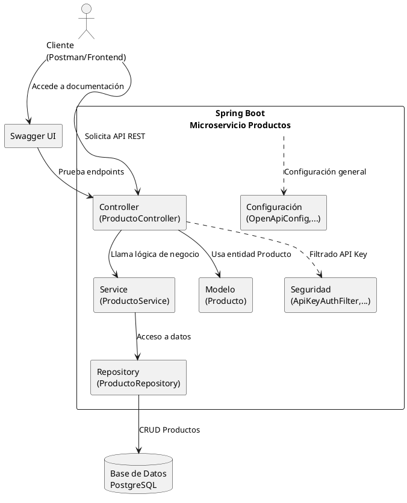

# Microservicio Productos

Este proyecto es un microservicio desarrollado en Spring Boot para la gestión de productos. Permite realizar operaciones CRUD (crear, leer, actualizar y eliminar) sobre productos almacenados en una base de datos PostgreSQL. Incluye autenticación por API Key y documentación interactiva con Swagger.

## Tabla de Contenidos
- [Características](#características)
- [Requisitos](#requisitos)
- [Instalación](#instalación)
- [Configuración](#configuración)
- [Ejecución](#ejecución)
- [Uso de la API](#uso-de-la-api)
- [Pruebas](#pruebas)
- [Docker](#docker)
- [Arquitectura](#arquitectura)
- [Autor](#autor)

## Tecnologías Utilizadas
- Java 17
- Spring Boot
- Spring Data JPA
- PostgreSQL
- Spring Security (API Key)
- Swagger/OpenAPI (springdoc-openapi)
- JUnit y Mockito
- Docker

## Endpoints Principales
| Método | Endpoint                | Descripción                        |
|--------|------------------------|------------------------------------|
| GET    | /api/productos         | Listar todos los productos         |
| GET    | /api/productos/{id}    | Obtener producto por ID            |
| POST   | /api/productos         | Crear un nuevo producto            |
| PUT    | /api/productos/{id}    | Actualizar un producto existente   |
| DELETE | /api/productos/{id}    | Eliminar un producto               |

Todos los endpoints requieren el header `X-API-KEY`.

## Estructura del Proyecto
```
Productos/
├── src/
│   ├── main/
│   │   ├── java/com/example/Productos/
│   │   │   ├── controller/        # Controladores REST
│   │   │   ├── service/           # Lógica de negocio
│   │   │   ├── repository/        # Acceso a datos (JPA)
│   │   │   ├── model/             # Entidades
│   │   │   ├── filter/            # Filtros de seguridad
│   │   │   ├── config/            # Configuración (Swagger, Seguridad)
│   │   │   └── security/          # Clases de autenticación
│   │   └── resources/
│   │       └── application.properties
│   └── test/
│       └── java/com/example/Productos/
│           ├── service/           # Pruebas de servicios
│           └── integration/       # Pruebas de integración
├── Dockerfile
├── pom.xml
└── README.md
```

## Características
- API RESTful para la gestión de productos
- Persistencia con Spring Data JPA y PostgreSQL
- Documentación OpenAPI/Swagger UI
- Seguridad mediante API Key
- Pruebas unitarias con JUnit y Mockito
- Listo para despliegue en Docker

## Requisitos
- Java 17 o superior
- Maven 3.9.x
- PostgreSQL

## Instalación
1. Clona el repositorio:
   ```sh
   git clone <URL-del-repositorio>
   cd Productos
   ```
2. Compila el proyecto:
   ```sh
   ./mvn clean package
   ```

## Configuración
Edita el archivo `src/main/resources/application.properties` para configurar la conexión a la base de datos y la API Key:

```properties
spring.datasource.url=jdbc:postgresql://localhost:5432/productosdb
spring.datasource.username=postgres
spring.datasource.password=tu_password
service.api.key=productos_secreta_12345
```

## Ejecución
Ejecuta la aplicación localmente:
```sh
java -jar target/Productos-0.0.1-SNAPSHOT.jar
```
Por defecto, la aplicación se ejecuta en [http://localhost:8080](http://localhost:8080).

## Uso de la API
- Accede a la documentación interactiva en: [http://localhost:8080/swagger-ui.html](http://localhost:8080/swagger-ui.html)
- Todas las rutas `/api/productos/**` requieren el header `X-API-KEY` con el valor configurado.

### Ejemplo de petición con API Key
```http
GET /api/productos HTTP/1.1
Host: localhost:8080
X-API-KEY: productos_secreta_12345
```

## Pruebas
Ejecuta las pruebas unitarias con:
```sh
./mvn test
```

## Docker
Para construir y ejecutar el microservicio junto con su base de datos usando Docker Compose:

1. Asegúrate de tener el archivo `docker-compose.yml` en el directorio raíz (fuera de la carpeta del proyecto `producto-service`).
2. Ejecuta el siguiente comando desde la ubicación del archivo `docker-compose.yml`:
   ```sh
   docker-compose up --build -d
   ```
   Esto levantará:
   - Una base de datos PostgreSQL para productos (`db_productos`)
   - El microservicio de productos (`producto-service`)

3. Para detener y eliminar los contenedores, ejecuta:
   ```sh
   docker-compose down
   ```

> **Nota:**
> - El microservicio se conectará automáticamente a la base de datos definida en el servicio `db_productos`.
> - Puedes acceder a la API en [http://localhost:8080](http://localhost:8080) y a la base de datos PostgreSQL en el puerto 5432.
> - Si tienes otros microservicios (como Inventario), puedes agregarlos al mismo archivo `docker-compose.yml` siguiendo la estructura mostrada.

## Arquitectura
El microservicio sigue una arquitectura en capas:
- **Controller:** Expone los endpoints REST.
- **Service:** Lógica de negocio.
- **Repository:** Acceso a datos con JPA.
- **Modelo:** Entidad Producto.
- **Seguridad:** Filtro de autenticación por API Key.
- **Configuración:** Swagger/OpenAPI y seguridad.

### Diagrama de Arquitectura (PlantUML)


## Autor
Anderson Ramirez Alejo  
anderson.ramirez@linktic.com